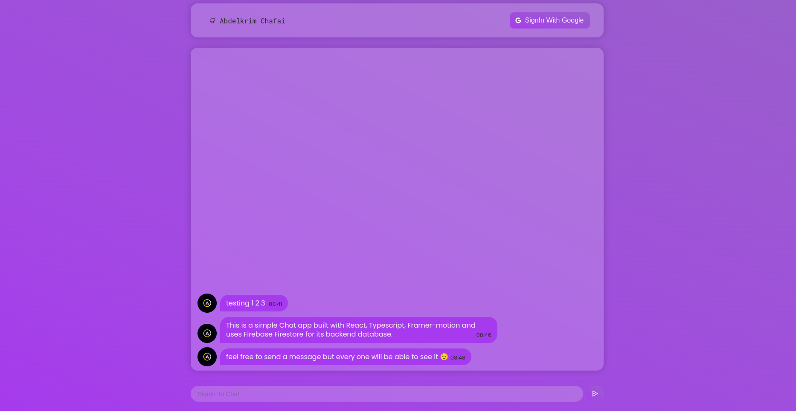

	<h1>Chat App
	 
		
		
        
		 
	</h1>
	<h3> 👇 live demo 👇 </h3>

## 📝 Description
My Take on building a simple Chat App. 
-I made this app with react. 
-Used the Framer Motion librery for animations. 
-Used Firebase Firestore as a database to store the messages info. 
-And styled the app with Css.

## 🛠️ Built with
- CSS.
- React.
- Firebase.
- Framer-Motion.

## Conclusion
I built this app to familiarize myself with Firebase and to use all the general web dev skills I have learned so far.